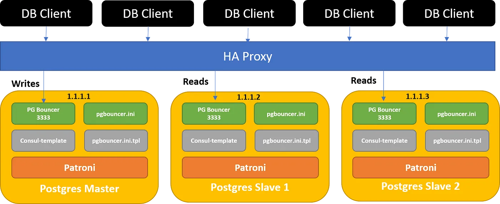

####################################### Architech ######333


)




#######################################
|     Role    | IP Addres     | Hostname                     | vCPU    | RAM       | Disk  |
|-------------| --------------|------------------------------|---------|-----------|-------|
| Master      | 10.48.6.11    | tpc-timescale-rnd-prod-01    | 4vCPU   | 8G RAM    | 100G  |
| Master      | 10.48.6.12    | tpc-timescale-rnd-prod-02    | 4vCPU   | 8G RAM    | 100G  |
| Master      | 10.48.6.13    | tpc-timescale-rnd-prod-03    | 4vCPU   | 8G RAM    | 100G  |
| VIP IP      | 10.48.6.10    | tpc-timescale-read           |         |           |       |

#######################################
|     Name Pool         | IP Addres     | Port Extend | Port Internal | Protocol/port   | Path     |  Code   |
|-----------------------| --------------|-------------|---------------|-----------------|----------|---------|
| datx-tsdb-pool-write  | 10.48.6.10    | 6000        | 5432          | http 8008       | /primary | 200     |
| datx-tsdb-pool-read   | 10.48.6.10    | 5000        | 5432          | http 8008       | /replica | 200     |
| datx-tsdb-pool-bouncer| 10.48.6.10    | 7000        | 6432          | http 8008       | /replica | 200     |
| datx-tsdb-pool-health | 10.48.6.10    | 8000        | 6432          | http 8008       | /replica | 200     |

Link tham khảo health check: https://patroni.readthedocs.io/en/latest/rest_api.html

Bước 1: Chuẩn Bị Môi Trường
Cài Đặt Các Gói Cần Thiết
Trên cả ba node, chạy các lệnh sau:


```shell
sudo apt update
sudo apt install -y wget gnupg2 lsb-release software-properties-common
Thêm Kho Lưu Trữ PostgreSQL và Cài Đặt PostgreSQL 14
```

Đồng bộ thời gian
```shell
sudo apt update
sudo apt install ntp -y
sudo systemctl start ntp
sudo systemctl enable ntp
sudo systemctl status ntp
sudo timedatectl set-timezone Asia/Ho_Chi_Minh
sudo hwclock --systohc
sudo hwclock
```

Thêm Kho Lưu Trữ PostgreSQL và Cài Đặt PostgreSQL 14

```shell
sudo sh -c 'echo "deb http://apt.postgresql.org/pub/repos/apt $(lsb_release -cs)-pgdg main" > /etc/apt/sources.list.d/pgdg.list'
wget --quiet -O - https://www.postgresql.org/media/keys/ACCC4CF8.asc | sudo apt-key add -
sudo apt update
sudo apt install -y postgresql-14 postgresql-server-dev-14
```

Bước 2: Cài Đặt TimescaleDB
```shell
#
sudo apt install gnupg postgresql-common apt-transport-https lsb-release wget
sudo /usr/share/postgresql-common/pgdg/apt.postgresql.org.sh
sudo apt install -y postgresql-14 postgresql-server-dev-14
echo "deb https://packagecloud.io/timescale/timescaledb/ubuntu/ $(lsb_release -c -s) main" | sudo tee /etc/apt/sources.list.d/timescaledb.list
wget --quiet -O - https://packagecloud.io/timescale/timescaledb/gpgkey | sudo gpg --dearmor -o /etc/apt/trusted.gpg.d/timescaledb.gpg
sudo apt update
sudo apt install timescaledb-2-postgresql-14='2.12.2*' postgresql-client-14 timescaledb-2-loader-postgresql-14='2.12.2*'
sudo timescaledb-tune

sudo systemctl restart postgresql
```

kiểm tra version đã cài đặt của timescale

```shell
dpkg -l | grep timescaledb
sudo systemctl status postgresql

```
```json
timescaledb-2-loader-postgresql-14 2.15.2~ubuntu22.04                      amd64        The loader for TimescaleDB to load individual versions.

```
Create extension timescaledb
```shell
$ sudo -u postgres psql
CREATE EXTENSION IF NOT EXISTS timescaledb;
```
```json

WARNING:
WELCOME TO
 _____ _                               _     ____________
|_   _(_)                             | |    |  _  \ ___ \
  | |  _ _ __ ___   ___  ___  ___ __ _| | ___| | | | |_/ /
  | | | |  _ ` _ \ / _ \/ __|/ __/ _` | |/ _ \ | | | ___ \
  | | | | | | | | |  __/\__ \ (_| (_| | |  __/ |/ /| |_/ /
  |_| |_|_| |_| |_|\___||___/\___\__,_|_|\___|___/ \____/
               Running version 2.12.2
For more information on TimescaleDB, please visit the following links:
```

```shell
sudo -u postgres psql
SELECT default_version, installed_version FROM pg_available_extensions WHERE name = 'timescaledb';

\dx
```
```json
 default_version | installed_version
-----------------+-------------------
 2.15.2          |
(1 row)
                List of installed extensions
  Name   | Version |   Schema   |         Description
---------+---------+------------+------------------------------
 plpgsql | 1.0     | pg_catalog | PL/pgSQL procedural language
(1 row)
```

Thử tạo một hypertable:

```sql
CREATE DATABASE test_timescale;
\c test_timescale
CREATE EXTENSION IF NOT EXISTS timescaledb;

CREATE TABLE test_table (
  time        TIMESTAMPTZ       NOT NULL,
  temperature DOUBLE PRECISION  NULL,
  location    TEXT              NOT NULL
);

SELECT create_hypertable('test_table', 'time');
```
Nếu lệnh này chạy mà không có lỗi, điều đó có nghĩa là TimescaleDB đang hoạt động.

## allowed all ip connect tới postgrest
$ nano /etc/postgresql/14/main/postgresql.conf
listen_addresses = '*'

$ sudo nano /etc/postgresql/14/main/pg_hba.conf
# IPv4 all IP:
host    all             all             0.0.0.0/0               md5
sudo systemctl restart postgresql

## cài đặt pg_stat_statements  giám sát lệnh (dùng với datacentinal trial 30 days)
$ nano /etc/postgresql/14/main/postgresql.conf

shared_preload_libraries = 'timescaledb, pg_stat_statements'
pg_stat_statements.track = all
pg_stat_statements.max = 10000  # limit query mornitor
pg_stat_statements.track_utility = on
$
sudo systemctl restart postgresql
sudo systemctl status postgresql

$ sudo -u postgres psql
\c postgres
CREATE EXTENSION pg_stat_statements;
CREATE USER datacentinel WITH PASSWORD 'yW!kcxB8lpwKTujZGz4bq2qS';
GRANT SELECT ON pg_stat_statements TO datacentinel;
GRANT pg_read_all_settings TO datacentinel;
GRANT pg_read_all_stats TO datacentinel;


# Bước 3 cài đặt pgBoucer
```shell
sudo apt install -y pgbouncer
sudo apt install timescaledb-toolkit-postgresql-14
```

Account và mã băm MD5 

 replication:
    username: replicator
    password: WjBMCibo53fPKgn3ppmYqkwf
    md5: md52bbd72eb898f8737730f497c56c44110
superuser:
    username: postgres
    password: 9fqmWLIDGdkMaSG2XnBiyIY9
    md5: md5411eea5492306085bf47e0be2240a4b8

```sql
$ sudo -u postgres psql
CREATE EXTENSION IF NOT EXISTS pgcrypto;

-- lấy mật khẩu md5 để điền vào file user pgbouncer
SELECT 'md5' || md5('9fqmWLIDGdkMaSG2XnBiyIY9' || 'postgres');
SELECT 'md5' || md5('WjBMCibo53fPKgn3ppmYqkwf' || 'replicator');
SELECT 'md5' || md5('eZ2cvBaeZj2cVz2DS23Q5Zg4' || 'data_read');
SELECT 'md5' || md5('7pHO8QUXMAiWzEORSYRtAvnv' || 'data_write');
```
```json
# replicator
              ?column?
-------------------------------------
 md52bbd72eb898f8737730f497c56c44110
# postgres
              ?column?
-------------------------------------
 md5411eea5492306085bf47e0be2240a4b8
(1 row)
```
## tạo account auth cho pgboucer
rm /etc/pgbouncer/userlist.txt
sudo tee /etc/pgbouncer/userlist.txt << EOF
"postgres"    "md5411eea5492306085bf47e0be2240a4b8"
"replicator"    "md52bbd72eb898f8737730f497c56c44110"
"data_read"     "md55cea59e87e611f4d30946f59463f9fab"
"data_write"     "md51d88add2461aca4627448be745052e1d"
EOF
cat /etc/pgbouncer/userlist.txt

Cài đặt file pgBoucer
```shell
cp /etc/pgbouncer/pgbouncer.ini /etc/pgbouncer/pgbouncer.ini.origin 
nano /etc/pgbouncer/pgbouncer.ini
```

```conf
[databases]
* = host=127.0.0.1 port=5432 user=postgres password=9fqmWLIDGdkMaSG2XnBiyIY9
replicator = host=127.0.0.1 port=5432 dbname=postgres user=replicator password=WjBMCibo53fPKgn3ppmYqkwf
data_read = host=127.0.0.1 port=5432 dbname=postgres user=data_read password=eZ2cvBaeZj2cVz2DS23Q5Zg4
data_write = host=127.0.0.1 port=5432 dbname=postgres user=data_write password=7pHO8QUXMAiWzEORSYRtAvnv

[pgbouncer]
listen_addr = *
listen_port = 6432
auth_type = md5
auth_file = /etc/pgbouncer/userlist.txt
admin_users = postgres
pool_mode = session
max_client_conn = 100
default_pool_size = 20
log_connections = 1
log_disconnections = 1
ignore_startup_parameters = extra_float_digits

```

sudo systemctl restart pgbouncer
sudo systemctl enable pgbouncer
sudo systemctl status pgbouncer

kiểm tra log pgbouncer
sudo journalctl -u pgbouncer | grep pgbouncer

## tạo user 
sudo -u postgres psql -h 10.48.6.11
$ sudo -u postgres psql 
\password postgres
# 9fqmWLIDGdkMaSG2XnBiyIY9

sql
-- create database datadb
CREATE DATABASE datadb;

-- create timescaledb extention for datadb
\c datadb
CREATE EXTENSION IF NOT EXISTS timescaledb;

-- create timescale toolkit for datadb
\c datadb
CREATE EXTENSION timescaledb_toolkit;
ALTER EXTENSION timescaledb_toolkit UPDATE;


-- tạo account nếu cần 
-- CREATE USER postgres WITH PASSWORD '9fqmWLIDGdkMaSG2XnBiyIY9';
CREATE USER replicator WITH PASSWORD 'WjBMCibo53fPKgn3ppmYqkwf';
CREATE USER data_read WITH PASSWORD 'eZ2cvBaeZj2cVz2DS23Q5Zg4';
CREATE USER data_write WITH PASSWORD '7pHO8QUXMAiWzEORSYRtAvnv';

-- nếu đã tồn tại
--ALTER USER postgres WITH PASSWORD '9fqmWLIDGdkMaSG2XnBiyIY9';
ALTER USER replicator WITH PASSWORD 'WjBMCibo53fPKgn3ppmYqkwf';
ALTER USER data_read WITH PASSWORD 'eZ2cvBaeZj2cVz2DS23Q5Zg4';
ALTER USER data_write WITH PASSWORD '7pHO8QUXMAiWzEORSYRtAvnv';


-- phần quyền account 
-- Grant superuser privileges to postgres user
ALTER USER postgres WITH SUPERUSER;

-- Grant replication privileges to replicator user
ALTER USER replicator WITH REPLICATION;

-- Grant read-only privileges to data_read user
GRANT CONNECT ON DATABASE prod_pms TO data_read;
GRANT USAGE ON SCHEMA public TO data_read;
GRANT SELECT ON ALL TABLES IN SCHEMA public TO data_read;
ALTER DEFAULT PRIVILEGES IN SCHEMA public GRANT SELECT ON TABLES TO data_read;

-- Grant read-write privileges to data_write user
GRANT CONNECT ON DATABASE prod_pms TO data_write;
GRANT USAGE ON SCHEMA public TO data_write;
GRANT SELECT, INSERT, UPDATE, DELETE ON ALL TABLES IN SCHEMA public TO data_write;
ALTER DEFAULT PRIVILEGES IN SCHEMA public GRANT SELECT, INSERT, UPDATE, DELETE ON TABLES TO data_write;


## thử kết nối qua pgbouncer
```sql
psql -U postgres -h 10.48.6.11 -p 6432 -c "\conninfo"

# 9fqmWLIDGdkMaSG2XnBiyIY9

psql -U replicator -h 10.48.6.11 -p 6432 -c "\conninfo"
# WjBMCibo53fPKgn3ppmYqkwf

```
kết quả thành công
```json
root@tpc-timescale-prd-01:~# psql -U postgres -h 10.48.6.11 -p 6432 -c "\conninfo"
Password for user postgres:
You are connected to database "postgres" as user "postgres" on host "10.48.6.11" at port "6432".
```

############################################ CAI DAT PATRONI ###################################################

################################################################################################################

# Bước 4: Cài Đặt Patroni

```shell
sudo apt install -y python3 python3-pip python3-venv
sudo apt install -y python3-dev libpq-dev
mkdir ~/patroni_env && cd ~/patroni_env
python3 -m venv venv
source venv/bin/activate
pip install psycopg2 psycopg
sudo pip3 install patroni[etcd]

```

##    kiểm tra petroni
```shell
cd ~/patroni_env
source venv/bin/activate
patronictl list
deactivate
```
```json
2024-06-21 15:02:44,810 - WARNING - Listing members: No cluster names were provided
```

Bước 4: Cài Đặt etcd
```shell
sudo apt install -y etcd
```
## kiểm tra petroni
```shell
pip3 list | grep patroni
```
```json
patroni             3.3.2
```
## kiểm tra etcd
```shell
sudo systemctl status etcd
etcd --version
ss -tunelp | grep etcd
dpkg -l | grep etcd
```
```json
patroni             3.3.1


ii  etcd                               3.3.25+dfsg-7ubuntu0.22.04.1            all          Transitional package for etcd-client and etcd-server
ii  etcd-client                        3.3.25+dfsg-7ubuntu0.22.04.1            amd64        highly-available key value store -- client
ii  etcd-server                        3.3.25+dfsg-7ubuntu0.22.04.1            amd64        highly-available key value store -- daemon

```
## Kiểm tra kết nối giữa Patroni và etcd:
```shell
#a. Thử kết nối tới etcd bằng etcdctl:
etcdctl member list
# b. Kiểm tra xem Patroni có thể tương tác với etcd
patronictl list
```

# Bước 4: Cài Đặt etcd
thông tin name etcd
```shell
# tpc-tsdb-etcd01 
```

```shell
# allow firewall 
sudo ufw allow from 10.48.6.0/24 to any port 2379
sudo ufw allow from 10.48.6.0/24 to any port 2380
```
-- Cấu hình etcd cho từng node 
'''*** NODE:
ETCD_INITIAL_CLUSTER_TOKEN:

Đây là một token duy nhất được sử dụng để xác định cụm etcd.
Nó giúp ngăn chặn các node etcd vô tình tham gia vào các cụm khác.
Bạn nên chọn một chuỗi duy nhất và có ý nghĩa cho cụm của mình.
Trong cấu hình của bạn, nó được đặt là "prod_token", điều này có vẻ phù hợp nếu đó là token bạn muốn sử dụng cho cụm của mình.


ETCD_INITIAL_CLUSTER_STATE:

Thông số này xác định trạng thái khởi tạo của cụm.
Có hai giá trị chính:
a. "new": Sử dụng khi bạn đang tạo một cụm etcd mới hoàn toàn.
b. "existing": Sử dụng khi bạn đang thêm một node mới vào cụm etcd đã tồn tại.
Trong cấu hình của bạn, nó được đặt là "new", điều này phù hợp nếu bạn đang thiết lập một cụm etcd mới.

'''

```shell
# tpc-timescale-rnd-prod-01
sudo mkdir -p /var/lib/etcd/postgresql
sudo chown -R etcd:etcd /var/lib/etcd/postgresql

sudo cp /etc/default/etcd	/etc/default/etcd.origin
cat << EOF | sudo tee /etc/default/etcd
ETCD_NAME=tpc-tsdb-etcd01
ETCD_INITIAL_CLUSTER="tpc-tsdb-etcd01=http://10.48.6.11:2380,tpc-tsdb-etcd02=http://10.48.6.12:2380,tpc-tsdb-etcd03=http://10.48.6.13:2380"
ETCD_INITIAL_CLUSTER_TOKEN="prod_token"
ETCD_INITIAL_CLUSTER_STATE="existing"
ETCD_INITIAL_ADVERTISE_PEER_URLS="http://10.48.6.11:2380"
ETCD_DATA_DIR="/var/lib/etcd/postgresql"
ETCD_LISTEN_PEER_URLS="http://10.48.6.11:2380"
ETCD_LISTEN_CLIENT_URLS="http://10.48.6.11:2379,http://localhost:2379"
ETCD_ADVERTISE_CLIENT_URLS="http://10.48.6.11:2379"
EOF

# tpc-timescale-rnd-prod-02
sudo cp /etc/default/etcd	/etc/default/etcd.origin
cat << EOF | sudo tee /etc/default/etcd
ETCD_NAME=tpc-tsdb-etcd02
ETCD_INITIAL_CLUSTER="tpc-tsdb-etcd01=http://10.48.6.11:2380,tpc-tsdb-etcd02=http://10.48.6.12:2380,tpc-tsdb-etcd03=http://10.48.6.13:2380"
ETCD_INITIAL_CLUSTER_TOKEN="prod_token"
ETCD_INITIAL_CLUSTER_STATE="new"
ETCD_INITIAL_ADVERTISE_PEER_URLS="http://10.48.6.12:2380"
ETCD_DATA_DIR="/var/lib/etcd/postgresql"
ETCD_LISTEN_PEER_URLS="http://10.48.6.12:2380"
ETCD_LISTEN_CLIENT_URLS="http://10.48.6.12:2379,http://localhost:2379"
ETCD_ADVERTISE_CLIENT_URLS="http://10.48.6.12:2379"
EOF

# tpc-timescale-rnd-prod-03
sudo cp /etc/default/etcd	/etc/default/etcd.origin
cat << EOF | sudo tee /etc/default/etcd
ETCD_NAME=tpc-tsdb-etcd03
ETCD_INITIAL_CLUSTER="tpc-tsdb-etcd01=http://10.48.6.11:2380,tpc-tsdb-etcd02=http://10.48.6.12:2380,tpc-tsdb-etcd03=http://10.48.6.13:2380"
ETCD_INITIAL_CLUSTER_TOKEN="prod_token"
ETCD_INITIAL_CLUSTER_STATE="new"
ETCD_INITIAL_ADVERTISE_PEER_URLS="http://10.48.6.13:2380"
ETCD_DATA_DIR="/var/lib/etcd/postgresql"
ETCD_LISTEN_PEER_URLS="http://10.48.6.13:2380"
ETCD_LISTEN_CLIENT_URLS="http://10.48.6.13:2379,http://localhost:2379"
ETCD_ADVERTISE_CLIENT_URLS="http://10.48.6.13:2379"
EOF
```
=> start etcd service
```shell
sudo systemctl restart etcd
sudo systemctl enable etcd
sudo systemctl status etcd
```
Kiểm tra kết nối 3 node
```shell

```
kết quả
```json
root@tpc-timescale-prd-01:~# ETCDCTL_API=3 etcdctl --endpoints=http://10.48.6.11:2379,http://10.48.6.12:2379,http://10.48.6.13:2379 member list
c4b6a99b0649ff5f, started, tpc-tsdb-etcd03, http://10.48.6.13:2380, http://10.48.6.13:2379
c5dcc96340d97f53, started, tpc-tsdb-etcd01, http://10.48.6.11:2380, http://10.48.6.11:2379
e84f5cdaeb15ebfc, started, tpc-tsdb-etcd02, http://10.48.6.12:2380, http://10.48.6.12:2379

```
# Bước 5: Cài Đặt Patroni

## tạo account ở mỗi node postgres

```shell
#!/bin/bash
# add node to host file
echo '10.48.6.11    tpc-timescale-rnd-prod-01'| sudo tee -a /etc/hosts
echo '10.48.6.12    tpc-timescale-rnd-prod-02'| sudo tee -a /etc/hosts
echo '10.48.6.13    tpc-timescale-rnd-prod-03'| sudo tee -a /etc/hosts

# Node 1 (tpc-timescale-rnd-prod-01)
echo "Creating users on tpc-timescale-rnd-prod-01..."
sudo -u postgres psql -c "CREATE USER replicator WITH REPLICATION PASSWORD 'WjBMCibo53fPKgn3ppmYqkwf';"
sudo -u postgres psql -c "CREATE USER postgres WITH SUPERUSER PASSWORD '9fqmWLIDGdkMaSG2XnBiyIY9';"
sudo -u postgres psql -c "ALTER USER replicator WITH PASSWORD 'WjBMCibo53fPKgn3ppmYqkwf';"
sudo -u postgres psql -c "ALTER USER postgres WITH PASSWORD '9fqmWLIDGdkMaSG2XnBiyIY9';"


echo "User creation completed."

```
Đăng Nhập Bằng Tài Khoản replicator

```sql
psql -U replicator -h 127.0.0.1 -d postgres -W

# WjBMCibo53fPKgn3ppmYqkwf
```

Đăng Nhập Bằng Tài Khoản replicator

```sql
psql -U postgres -h 127.0.0.1 -d postgres -W

# 9fqmWLIDGdkMaSG2XnBiyIY9
```
## Cấu hình Patroni config
*** NOTE: cách tìm 3 đường dẫn 
data_dir -->  sudo -u postgres grep data_directory /etc/postgresql/14/main/postgresql.conf
config_dir --> sudo -u postgres psql -c "SHOW config_file;" 
bin_dir --> pg_config --bindir
***

```shell
# tpc-timescale-rnd-prod-01
sudo cp /etc/patroni.yml	/etc/patroni.yml.origin

cat << EOF | sudo tee /etc/patroni.yml
scope: timescaledb-cluster
namespace: /db/
name: tpc-timescale-rnd-prod-01

restapi:
    listen: 10.48.6.11:8008
    connect_address: 10.48.6.11:8008

etcd:
    hosts:  10.48.6.11:2379,10.48.6.12:2379,10.48.6.13:2379

bootstrap:
    dcs:
        ttl: 30
        loop_wait: 10
        retry_timeout: 10
        maximum_lag_on_failover: 1048576
        postgresql:
            use_pg_rewind: true
            use_slots: true
            parameters:
                wal_level: logical
                enable_partitionwise_aggregate: on
                jit: off
                max_prepared_transactions: 150
                statement_timeout: 0
                idle_in_transaction_session_timeout: 300000
                max_connections: 5000
                shared_preload_libraries: 'timescaledb'        # (change requires restart)
                shared_buffers: 1987MB
                effective_cache_size: 5962MB
                maintenance_work_mem: 1017625kB
                work_mem: 5088kB
                timescaledb.max_background_workers: 16
                max_worker_processes: 23
                max_parallel_workers_per_gather: 2
                max_parallel_workers: 4
                wal_buffers: 16MB
                min_wal_size: 512MB
                default_statistics_target: 500
                random_page_cost: 1.1
                checkpoint_completion_target: 0.9
                max_locks_per_transaction: 64
                autovacuum_max_workers: 10
                autovacuum_naptime: 10
                effective_io_concurrency: 256
                timescaledb.last_tuned: '2023-11-01T18:10:47+07:00'
                timescaledb.last_tuned_version: '0.14.3'

    initdb:
    - encoding: UTF8
    - data-checksums

    pg_hba:
    - host replication replicator 127.0.0.1/32 md5
    - host replication replicator 10.48.6.11/0 md5
    - host replication replicator 10.48.6.12/0 md5
    - host replication replicator 10.48.6.13/0 md5
    - host all all 0.0.0.0/0 md5
    - host all all 127.0.0.1/32 md5

    users:
        admin:
            password: admin
            options:
                - createrole
                - createdb

postgresql:
    listen: 0.0.0.0:5432
    connect_address: 10.48.6.11:5432
    data_dir: /var/lib/postgresql/14/main/   # thu muc chua data
    config_dir: /etc/postgresql/14/main/    # thu muc chua config
    bin_dir: /usr/lib/postgresql/14/bin   # thu muc chua file pg_controldata quan tri cluster cua postgres
    pgpass: /tmp/pgpass
    authentication:
        replication:
            username: replicator
            password: WjBMCibo53fPKgn3ppmYqkwf
        superuser:
            username: postgres
            password: 9fqmWLIDGdkMaSG2XnBiyIY9
    parameters:
        unix_socket_directories: '.'
        shared_preload_libraries: 'timescaledb'

watchdog:
    mode: off # Allowed values: off, automatic, required
    device: /dev/watchdog
    safety_margin: 5

tags:
    nofailover: false
    noloadbalance: false
    clonefrom: false
    nosync: false
EOF
```

```shell
# tpc-timescale-rnd-prod-02
sudo cp /etc/default/etcd	/etc/default/etcd.origin
cat << EOF | sudo tee /etc/patroni.yml
scope: timescaledb-cluster
namespace: /db/
name: tpc-timescale-rnd-prod-01

restapi:
    listen: 10.48.6.12:8008
    connect_address: 10.48.6.12:8008

etcd:
    hosts:  10.48.6.11:2379,10.48.6.12:2379,10.48.6.13:2379

bootstrap:
    dcs:
        ttl: 30
        loop_wait: 10
        retry_timeout: 10
        maximum_lag_on_failover: 1048576
        postgresql:
            use_pg_rewind: true
            use_slots: true
            parameters:
                wal_level: logical
                enable_partitionwise_aggregate: on
                jit: off
                max_prepared_transactions: 150
                statement_timeout: 0
                idle_in_transaction_session_timeout: 300000
                max_connections: 5000
                shared_preload_libraries: 'timescaledb'        # (change requires restart)
                shared_buffers: 1987MB
                effective_cache_size: 5962MB
                maintenance_work_mem: 1017625kB
                work_mem: 5088kB
                timescaledb.max_background_workers: 16
                max_worker_processes: 23
                max_parallel_workers_per_gather: 2
                max_parallel_workers: 4
                wal_buffers: 16MB
                min_wal_size: 512MB
                default_statistics_target: 500
                random_page_cost: 1.1
                checkpoint_completion_target: 0.9
                max_locks_per_transaction: 64
                autovacuum_max_workers: 10
                autovacuum_naptime: 10
                effective_io_concurrency: 256
                timescaledb.last_tuned: '2023-11-01T18:10:47+07:00'
                timescaledb.last_tuned_version: '0.14.3'

    initdb:
    - encoding: UTF8
    - data-checksums

    pg_hba:
    - host replication replicator 127.0.0.1/32 md5
    - host replication replicator 10.48.6.11/0 md5
    - host replication replicator 10.48.6.12/0 md5
    - host replication replicator 10.48.6.13/0 md5
    - host all all 0.0.0.0/0 md5
    - host all all 127.0.0.1/32 md5

    users:
        admin:
            password: admin
            options:
                - createrole
                - createdb

postgresql:
    listen: 0.0.0.0:5432
    connect_address: 10.48.6.11:5432
    data_dir: /var/lib/postgresql/14/main/   # thu muc chua data
    config_dir: /etc/postgresql/14/main/    # thu muc chua config
    bin_dir: /usr/lib/postgresql/14/bin   # thu muc chua file pg_controldata quan tri cluster cua postgres
    pgpass: /tmp/pgpass
    authentication:
        replication:
            username: replicator
            password: WjBMCibo53fPKgn3ppmYqkwf
        superuser:
            username: postgres
            password: 9fqmWLIDGdkMaSG2XnBiyIY9
    parameters:
        unix_socket_directories: '.'
        shared_preload_libraries: 'timescaledb'

watchdog:
    mode: off # Allowed values: off, automatic, required
    device: /dev/watchdog
    safety_margin: 5

tags:
    nofailover: false
    noloadbalance: false
    clonefrom: false
    nosync: false
EOF
```
```shell
# tpc-timescale-rnd-prod-03
sudo cp /etc/default/etcd	/etc/default/etcd.origin
cat << EOF | sudo tee /etc/patroni.yml
scope: timescaledb-cluster
namespace: /db/
name: tpc-timescale-rnd-prod-01

restapi:
    listen: 10.48.6.13:8008
    connect_address: 10.48.6.13:8008

etcd:
    hosts:  10.48.6.11:2379,10.48.6.12:2379,10.48.6.13:2379

bootstrap:
    dcs:
        ttl: 30
        loop_wait: 10
        retry_timeout: 10
        maximum_lag_on_failover: 1048576
        postgresql:
            use_pg_rewind: true
            use_slots: true
            parameters:
                wal_level: logical
                enable_partitionwise_aggregate: on
                jit: off
                max_prepared_transactions: 150
                statement_timeout: 0
                idle_in_transaction_session_timeout: 300000
                max_connections: 5000
                shared_preload_libraries: 'timescaledb'        # (change requires restart)
                shared_buffers: 1987MB
                effective_cache_size: 5962MB
                maintenance_work_mem: 1017625kB
                work_mem: 5088kB
                timescaledb.max_background_workers: 16
                max_worker_processes: 23
                max_parallel_workers_per_gather: 2
                max_parallel_workers: 4
                wal_buffers: 16MB
                min_wal_size: 512MB
                default_statistics_target: 500
                random_page_cost: 1.1
                checkpoint_completion_target: 0.9
                max_locks_per_transaction: 64
                autovacuum_max_workers: 10
                autovacuum_naptime: 10
                effective_io_concurrency: 256
                timescaledb.last_tuned: '2023-11-01T18:10:47+07:00'
                timescaledb.last_tuned_version: '0.14.3'

    initdb:
    - encoding: UTF8
    - data-checksums

    pg_hba:
    - host replication replicator 127.0.0.1/32 md5
    - host replication replicator 10.48.6.11/0 md5
    - host replication replicator 10.48.6.12/0 md5
    - host replication replicator 10.48.6.13/0 md5
    - host all all 0.0.0.0/0 md5
    - host all all 127.0.0.1/32 md5

    users:
        admin:
            password: admin
            options:
                - createrole
                - createdb

postgresql:
    listen: 0.0.0.0:5432
    connect_address: 10.48.6.11:5432
    data_dir: /var/lib/postgresql/14/main/   # thu muc chua data
    config_dir: /etc/postgresql/14/main/    # thu muc chua config
    bin_dir: /usr/lib/postgresql/14/bin   # thu muc chua file pg_controldata quan tri cluster cua postgres
    pgpass: /tmp/pgpass
    authentication:
        replication:
            username: replicator
            password: WjBMCibo53fPKgn3ppmYqkwf
        superuser:
            username: postgres
            password: 9fqmWLIDGdkMaSG2XnBiyIY9
    parameters:
        unix_socket_directories: '.'
        shared_preload_libraries: 'timescaledb'

watchdog:
    mode: off # Allowed values: off, automatic, required
    device: /dev/watchdog
    safety_margin: 5

tags:
    nofailover: false
    noloadbalance: false
    clonefrom: false
    nosync: false
EOF
```

## cập nhật pg_hba.conf để cho phép các kết nối từ node patroni khác

```shell
$ nano /etc/postgresql/14/main/pg_hba.conf


# Allow replication connections from local and remote nodes
host    replication     replicator     127.0.0.1/32          md5
host    replication     replicator     10.48.6.11/32         md5
host    replication     replicator     10.48.6.12/32         md5
host    replication     replicator     10.48.6.13/32         md5

# Allow connections to PostgreSQL from local and remote nodes
host    all             all            127.0.0.1/32          md5
host    all             all            10.48.6.11/32         md5
host    all             all            10.48.6.12/32         md5
host    all             all            10.48.6.13/32         md5
```

## Tạo Dịch Vụ Systemd Cho Patroni (all nodes)
```shell
cat << EOF | sudo tee /etc/systemd/system/patroni.service
[Unit]
Description=Patroni
After=network.target

[Service]
Type=simple
User=postgres
Group=postgres
WorkingDirectory=/var/lib/postgresql
ExecStart=/usr/local/bin/patroni /etc/patroni.yml
ExecReload=/bin/kill -s HUP $MAINPID
KillMode=process
TimeoutSec=30

[Install]
WantedBy=multi-user.target
EOF
cat /etc/systemd/system/patroni.service
# khoi dong lai 
sudo systemctl daemon-reload
sudo systemctl restart patroni
sudo systemctl enable patroni
sudo systemctl status patroni

```
## khởi tạo leader cho patroni

```shell
# kiểm tra log patroni xem đã kết nối
$ sudo journalctl -u patroni | grep patroni
# kiểm tra bình bầu leader của etcd
$ etcdctl --endpoints=http://10.48.6.11:2379,http://10.48.6.12:2379,http://10.48.6.13:2379 member list

```
```json
23:13:09 tpc-timescale-prd-01 patroni[224431]: 10.48.6.11:5432 - accepting connections
Jun 23 23:13:09 tpc-timescale-prd-01 patroni[224433]: 10.48.6.11:5432 - accepting connections
Jun 23 23:13:09 tpc-timescale-prd-01 patroni[224391]: 2024-06-23 23:13:09,375 INFO: establishing a new patroni heartbeat connection to postgres
Jun 23 23:13:09 tpc-timescale-prd-01 patroni[224391]: 2024-06-23 23:13:09,399 WARNING: Watchdog device is not usable
Jun 23 23:13:09 tpc-timescale-prd-01 patroni[224391]: 2024-06-23 23:13:09,425 INFO: following a different leader because i am not the healthiest node
Jun 23 23:13:19 tpc-timescale-prd-01 patroni[224391]: 2024-06-23 23:13:19,378 WARNING: Watchdog device is not usable
Jun 23 23:13:19 tpc-timescale-prd-01 patroni[224391]: 2024-06-23 23:13:19,407 INFO: following a different leader because i am not the healthiest node

----------

c4b6a99b0649ff5f: name=tpc-tsdb-etcd03 peerURLs=http://10.48.6.13:2380 clientURLs=http://10.48.6.13:2379 isLeader=false
c5dcc96340d97f53: name=tpc-tsdb-etcd01 peerURLs=http://10.48.6.11:2380 clientURLs=http://10.48.6.11:2379 isLeader=true
e84f5cdaeb15ebfc: name=tpc-tsdb-etcd02 peerURLs=http://10.48.6.12:2380 clientURLs=http://10.48.6.12:2379 isLeader=false

```


```shell


# kiểm tra tình trạng cluster patroni
$ patronictl -c /etc/patroni.yml list timescaledb-cluster 
# khởi tạo cụm cluster patroni
$ patronictl -c /etc/patroni.yml reinit timescaledb-cluster 

+ Cluster: timescaledb-cluster (uninitialized) ---------+----+----------- 
| Member             | Host         | Role    | State   | TL | Lag in MB  
+--------------------+--------------+---------+---------+----+-----------
| tpc-timescale-rnd-prod-01 | 10.48.6.11 | Replica | running |  1 |         0 
| tpc-timescale-rnd-prod-02 | 10.48.6.12 | Replica | running |  1 |         0  
| tpc-timescale-rnd-prod-03 | 10.48.6.13 | Replica | running |  1 |         0 
+--------------------+--------------+---------+---------+----+-----------  

+ Cluster: timescaledb-cluster (7390675783010376504) ----------+----+-----------+-----------------+-----------------------------+
| Member                    | Host       | Role    | State     | TL | Lag in MB | Pending restart | Pending restart reason      |
+---------------------------+------------+---------+-----------+----+-----------+-----------------+-----------------------------+
| tpc-timescale-rnd-prod-01 | 10.48.6.11 | Leader  | running   |  4 |           |                 |                             |
| tpc-timescale-rnd-prod-02 | 10.48.6.12 | Replica | streaming |  4 |         0 |                 |                             |
| tpc-timescale-rnd-prod-03 | 10.48.6.13 | Replica | stopped   |    |   unknown | *               | max_worker_processes: 21->8 |
+---------------------------+------------+---------+-----------+----+-----------+-----------------+-----------------------------+
Which member do you want to reinitialize [tpc-timescale-rnd-prod-02, tpc-timescale-rnd-prod-03]? []: tpc-timescale-rnd-prod-02
Are you sure you want to reinitialize members datx-tsdb02? [y/N]: y
Failed: reinitialize for member datx-tsdb02, status code=503, (restarting after failure already in progress)
Do you want to cancel it and reinitialize anyway? [y/N]: y
Success: reinitialize for member datx-tsdb02    

```
```shell
# kiểm tra kết nối từ patronin tới etcd
curl http://10.48.6.11:2379/v2/keys/
curl http://10.48.6.12:2379/v2/keys/
curl http://10.48.6.13:2379/v2/keys/
```


# Chạy và kiểm tra dịch vụ
sudo systemctl restart etcd
sudo systemctl restart postgresql
sudo systemctl restart patroni
sudo systemctl restart pgbouncer

sudo systemctl status etcd
sudo systemctl status pgbouncer
sudo systemctl status postgresql
sudo systemctl restart patroni
sudo systemctl status patroni

sudo journalctl -u patroni


check patroni
patronictl -c /etc/patroni.yml list timescaledb-cluster 
sudo journalctl -u patroni | grep patroni

patronictl reload timescaledb-cluster 

nano /etc/postgresql/14/main/
nano /etc/postgresql/14/main/pg_hba.conf
/usr/lib/postgresql/14/bin


# tunning patroni
timescaledb-tune --quiet --yes --dry-run 2>&1 tuned_params.txt

############################ Install HA for Timescale DB ###################

# 1. Health Check link
## primary
curl -i -X OPTIONS http://10.48.6.11:8008/primary
## replica
curl -i -X OPTIONS http://10.48.6.12:8008/replica
curl -i -X OPTIONS http://10.48.6.13:8008/replica

## health check 
curl -i -X OPTIONS http://10.48.6.13:8008/replica